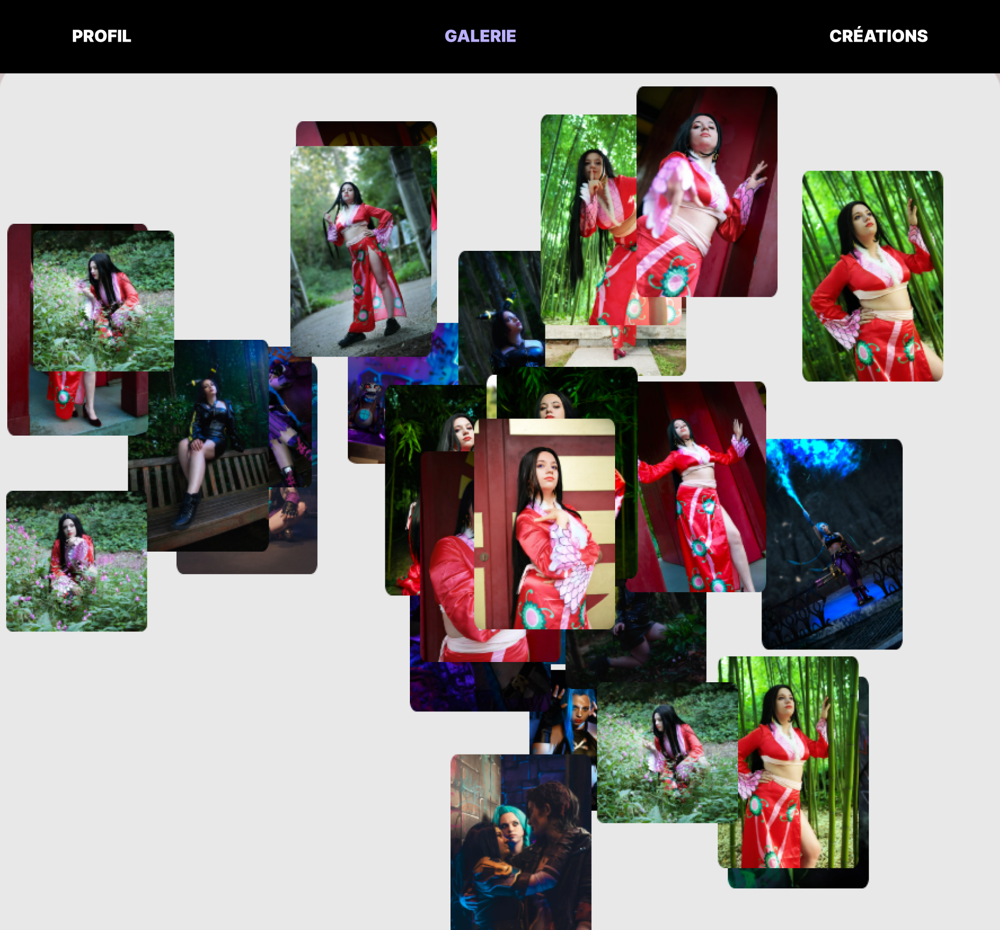
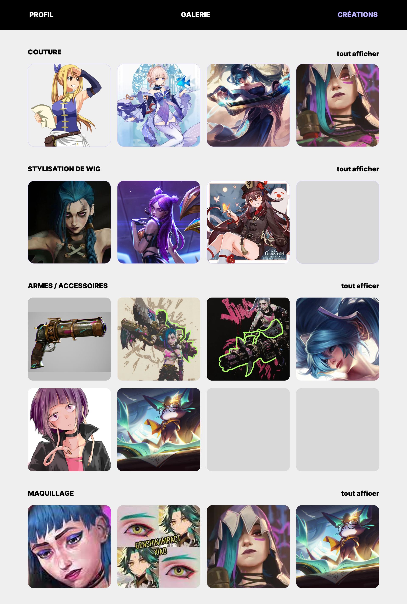
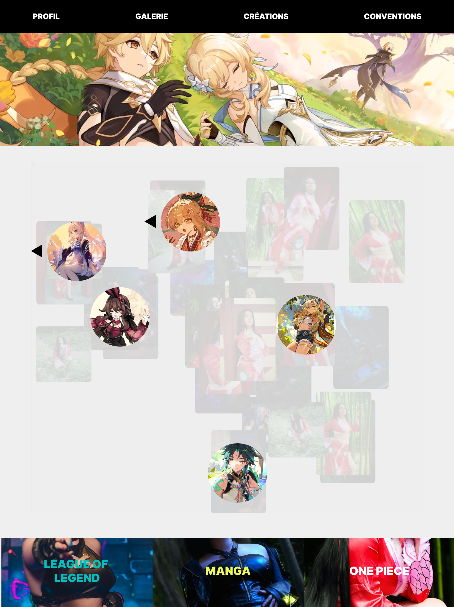
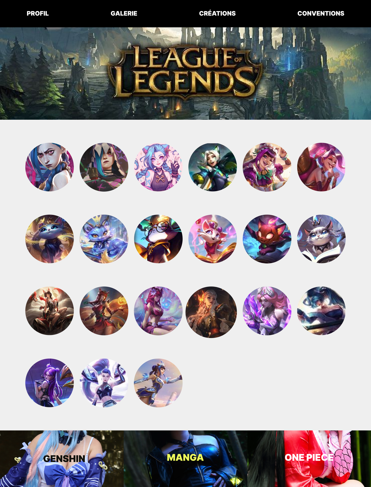
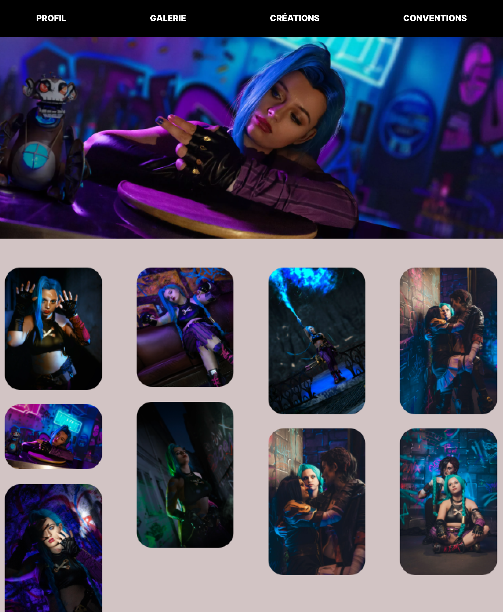

# Portfolio Cosplay

## pour faire une visualisations de la page : 

### Exemple de style de text

Journal de bord de mon projet. 
_italique_ 
**gras** 
**_gras-italique_** 
~~barré~~ 

```bloc de code```

Exemple [de lien](https://docs.framasoft.org/fr/grav/markdown.html)


VOICI QUELQUES INFORMATIONS SUR MON PROJET :

1. Un court descriptif de votre idée 

L'objectif de ce projet était de créer un portfolio pour mettre en valeur ma deuxième passion : le cosplay. J'y présente une brève introduction sur mon parcours, suivie d'une mise en avant de mes créations et des shootings que j'ai réalisées.

2. Captures d'écran des étapes du projet (chronologie + dates + figma)


La galerie est la pour mettre en avant tous mes shooting cosplay.



Ma partie créations sert a mettre en avant les réalisations que j'ai pu faire ou celles qui sont en cour ou a venir. Elle sont la pour mettre en avant mes compétences. Et penvent maider a vendre mes services.



J'ai séparée en 4 grandes catégorie mes cosplay. Dans chaque catégorie on pourras voyager a travers les differents cosplays qui la concerne. Et cliquer sur celui qui nous intéresse pour plus de renseignement. 



Pour le moment les images aparaissent au meme endroit mais jai pour objectif de les faire apparaitre plus dans un design comme celui la.



Voici a quoi ressemble une page lorsque lon clique sur le cosplay que lon veux voir.



Cela est également un autre exemple de design si le shooting na pas encore ete réalisé ou publié.


3. Focus (points de détails du projet : code, images...)
4. La structure du projet (navigation, pages...)